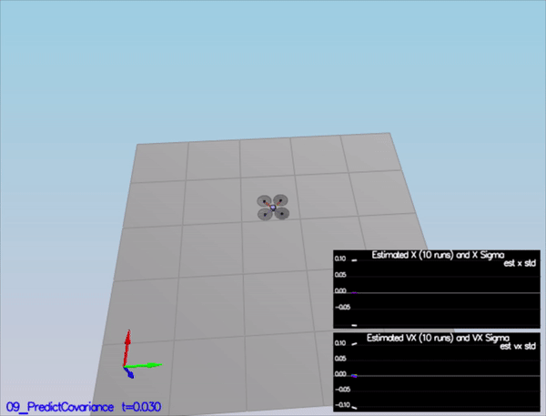

# Udacity Flying Car Nanodegree #
# Project 4: Estimation #

## Description ##
In this project, we apply our custom-built flight controller from Project 3 to a realistic simulation environment that takes into account updates from IMU, GPS, magnetometer, and gyroscope sensors. By applying an Extended Kalman Filter, controller feedback is integrated with sensor measurements to perform real-time, accurate updates to the estimator.

## Rubric Criteria: Implement Estimator ##

### 1. Determine the standard deviation of the measurement noise of both GPS X data and Accelerometer X data. ###

This was achieved by applying the data in `config/log/Graph1.txt` and `config/log/Graph2.txt` to a spreadsheet program in order to find out approximate standard deviations. These values could equivalently (though less quickly) be calculated from a short Python script such as the one below:

```
import numpy as np

gpsData = np.loadtxt('./Graph1.txt', delimiter = ',', dtype='Float64', skiprows = 1)[:, 1]
accelData = np.loadtxt('./Graph2.txt', delimiter = ',', dtype='Float64', skiprows = 1)[:, 1]
gpsStd = np.std(gpsData)
accelStd = np.std(accelData)
print(gpsStd)
print(accelStd)
```

The standard deviations of `0.6711659` from the GPS data and `0.4746351` from the accelerometer data were saved in the `06_SensorNoise.txt` file, with the following result achieved:


As the image shows, this resulted in GPS x-axis values that were within one standard deviation 68% of the time, and accelerometer x-axis values which were within one standard deviation 66% of the time.


### 2. Implement a better rate gyro attitude integration scheme in the `UpdateFromIMU()` function. ###

Here is the code I used to update the IMU, which makes use of quaternions to integrate the body rates into Euler angles:

```
	// Use quaternions to integrate the new body rates
	Quaternion<float> qt = Quaternion<float>::FromEuler123_RPY(rollEst, pitchEst, ekfState(6));
	qt.IntegrateBodyRate(gyro, dtIMU);

	// Prepare roll and pitch predictions for later calculation
	float predictedRoll = qt.Roll();
	float predictedPitch = qt.Pitch();
	ekfState(6) = qt.Yaw();
```

This resulted in the following noiseless simulator scenario:


As seen above, this resulted in an attitude estimation within 0.02 radians for each Euler angle, which is well within the < 0.1 rad requirement.

### 3. Implement all of the elements of the prediction step for the estimator. ###

The `PredictState()` function, as the name implies, predicts what the state will be based on current gyro measurements and accelerations. For this, state variables were found using integration methods and an attitude frame conversion, as shown below:

```
  // Integrate state variables
  for (int i = 0; i < 3; i++)
  {
	  predictedState[i] += dt * predictedState[i+3];
  }

  // Rotation of the attitude quaternion from body frame to inertial frame
  V3F att = attitude.Rotate_BtoI(accel);
 
  predictedState[3] += dt * att.x;
  predictedState[4] += dt * att.y;
  predictedState[5] += dt * (att.z - CONST_GRAVITY);
```

Next, the roll/pitch/yaw rotation matrix from body frame to ground frame was calculated in `GetRbgPrime()` using results from the "Estimation for Quadrotors" paper shared in class:

```
  // Use formulas found in the Estimation of Quadrotors paper
  RbgPrime(0, 0) = -cos(pitch) * sin(yaw);
  RbgPrime(0, 1) = -sin(roll)  * sin(pitch) * sin(yaw) - cos(roll) * cos(yaw);
  RbgPrime(0, 2) = -cos(roll)  * sin(pitch) * sin(yaw) + sin(roll) * cos(yaw);
  RbgPrime(1, 0) =  cos(pitch) * cos(yaw);
  RbgPrime(1, 1) =  sin(roll)  * sin(pitch) * cos(yaw) - cos(roll) * sin(yaw);
  RbgPrime(1, 2) =  cos(roll)  * sin(pitch) * cos(yaw) + sin(roll) * sin(yaw);
  RbgPrime(2, 0) = 0;
  RbgPrime(2, 1) = 0;
  RbgPrime(2, 2) = 0;
```

Here is a view of the equation on paper:


Next, the transition function Jacobian was calculated using acceleration commands in the `Predict()` step, and the state covariance was updated using Extended Kalman Filter equations:

```
  // Transition function Jacobian
  gPrime(0, 3) = dt;
  gPrime(1, 4) = dt;
  gPrime(2, 5) = dt;
  gPrime(3, 6) = (RbgPrime(0, 0) * accel.x + RbgPrime(0, 1) * accel.y + RbgPrime(0, 2) * accel.z) * dt;
  gPrime(4, 6) = (RbgPrime(1, 0) * accel.x + RbgPrime(1, 1) * accel.y + RbgPrime(1, 2) * accel.z) * dt;
  gPrime(5, 6) = (RbgPrime(2, 0) * accel.x + RbgPrime(2, 1) * accel.y + RbgPrime(2, 2) * accel.z) * dt;

  // Update the state covariance using Extended Kalman Filter equations and transition model covariance, i.e. "process noise"
  ekfCov = gPrime * ekfCov * gPrime.transpose() + Q;
```


Here is what resulted in the simulator scenarios for predicting the state and covariance:




### 4. Implement the magnetometer update. ###

The magnetometer update was carried out by finding the difference between magnetometer yaw and current yaw, and then normalizing to find the standard position of the angle formed:

```
  // Calculate difference
  float magDiff = magYaw - ekfState(6);
  // Normalize difference
  if (magDiff > F_PI)
  {
	  magDiff += -2.0f * F_PI;
  }
  else if (magDiff < -F_PI) {
	  magDiff += 2.0f * F_PI;
  }
  // Update zFromX and hPrime
  zFromX(0) = z(0) - magDiff;
  hPrime(0, 6) = 1;
```

Here's what it looked like in the simulator:


In particular, the error in yaw is maintained below 0.1 radians throughout the simulation, while the chosen standard deviation in yaw caused values to fall within it 71% of the time.

Here are the relevant parameter values which make this possible:

```
# From QuadEstimatorEKF.txt #

QYawStd = .13
```

```
# From QuadControlParams.txt #

# Position control gains
kpPosXY = 42
kpPosZ = 42
KiPosZ = 16.777216

# Velocity control gains
kpVelXY = 25
kpVelZ = 25
```

### 5. Implement the GPS update. ###

The state update from GPS consisted of the steps outlined below from the `UpdateFromGPS()` function:

```
  // Set GPS measurement model Jacobian
  for (int i = 0; i < 6; i++)
  {
	  hPrime(i, i) = 1.0f;
	  zFromX(i) = ekfState(i);
  }
```

Since we get position and velocity directly from GPS, the measurement model Jacobian was simple to implement, as its derivation in the paper mentioned previously demonstrates:


Here is the result of incorporating the GPS information. While jittery, we see that it does stay within the 1m estimation error performance range for the duration of the scenario:


## Rubric Criteria: Flight Evaluation ##

### 6. Meet the performance criteria of each step. ###

`QuadControl.cpp` and `QuadControlParams.txt`, the flight controller and associated parameters from Project 3, were implemented, and all performance criteria were met after its incorporation. The estimator parameters were further adjusted to ensure performance.

In fact, all snips and performance information above were collected after implementing this controller.

### 7. De-tune your controller to successfully fly the final desired box trajectory with your estimator and realistic sensors. ###

The controller parameters were detuned a bit to accommodate the new estimator functions. Here is a view of the relevant portions of `QuadControlParams.txt` before detuning:

```
# Position control gains
kpPosXY = 64
kpPosZ = 64
KiPosZ = 16.777216

# Velocity control gains
kpVelXY = 25
kpVelZ = 25
```

After tuning position gains by around -30%, these were the parameter values:

```
# Position control gains
kpPosXY = 42
kpPosZ = 42
KiPosZ = 16.777216

# Velocity control gains
kpVelXY = 25
kpVelZ = 25
```

The end result was a trajectory which did not deviate more than 1m in estimated position throughout the entire flight:

